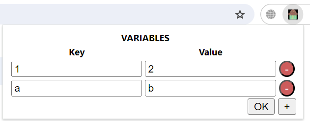

# chrome-extension-01

(현재로서는 업데이트 예정이 없고, 개발자만 사용하기 때문에 수익을 낼 만한 프로그램이 아니라 판단해서 크롬 확장자 마켓에 올리진 않았습니다)

## My Gitlab Pipeline Variable Automation

1. `git clone`
2. 크롬 브라우저를 열고 "chrome://extensions/"에 접속합니다.
3. 우측 상단에 개발자 모드를 on 합니다.

4. "압축해제된 확장 프로그램을 로드합니다" 버튼을 클릭 후 `git clone`한 위치의 폴더를 선택합니다.
5. 아래와 같은 식으로 파이프라인에 입력할 변수를 타이핑한 후 "OK" 버튼을 클릭합니다. 이때 입력한 변수는 자동으로 저장됩니다.

